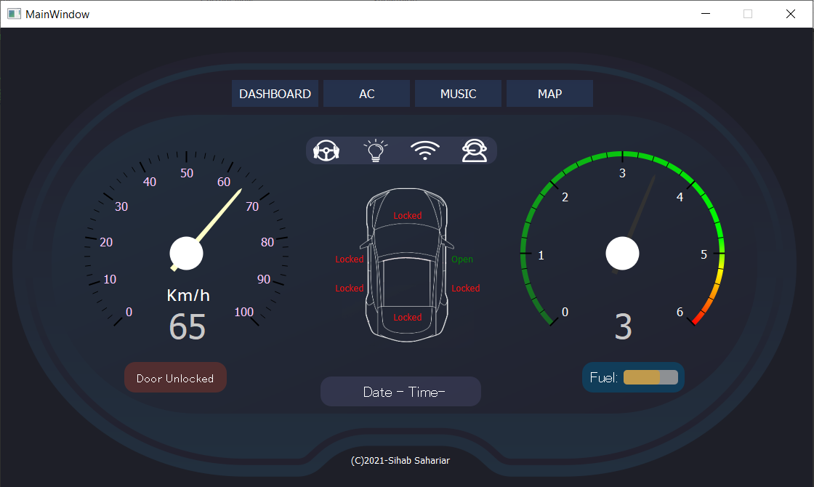
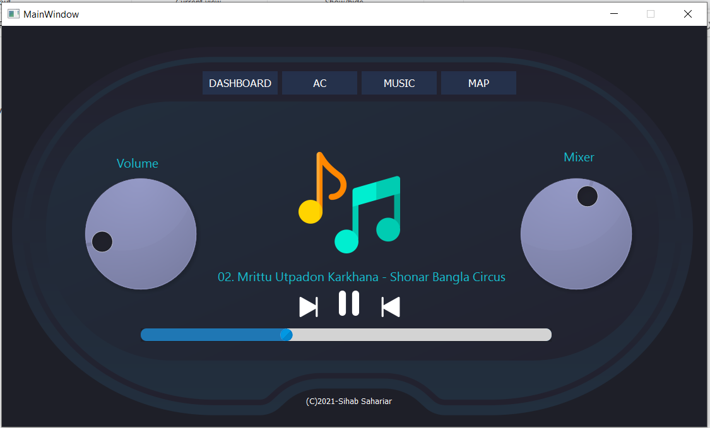
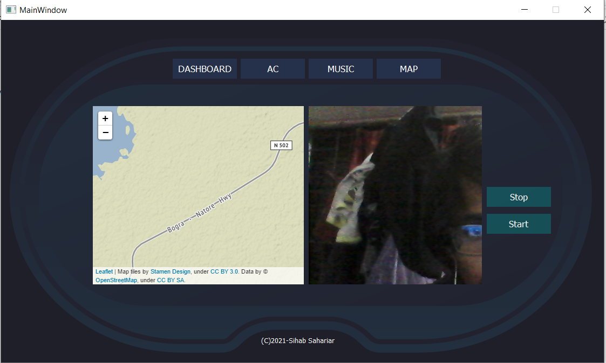

# Car Dashboard (HMI) Prototype

Welcome to the Car Dashboard (HMI) prototype project! This simple yet intuitive dashboard is designed for a comprehensive in-car user experience. Check out the features and planned enhancements below.

## Features

1. **Speedometer**
   - Real-time display of vehicle speed for a safer driving experience.

2. **Fuel Status**
   - Keep track of your fuel level to plan your refueling stops effectively.

3. **Door Status**
   - Monitor the status of your car doors for enhanced security.

4. **AC/Music Controller**
   - Control your car's air conditioning and music system seamlessly from the dashboard.

5. **Map for Navigation**
   - Integrated navigation system to guide you through your journeys.

6. **Weather Forecast**
   - Stay informed about the weather conditions to plan your trips accordingly.

7. **Camera Streaming**
   - Access live camera feeds for improved awareness and safety.
   - Supports turning the camera on & off.
   - Handles camera failures (camera is unavailable or gets disconnected during use).

8. **Prerecorded Video Streaming**
   - When camera is unavailable (i.e., during development or demos), you can play video instead.
   - Supports stopping the video & starting it again.
   - Handles video file failures (file doesn't exist or video stream gets interrupted/corrupted).

## Development

1. Create a Python virtual environment (optional but recommended):
```bash
$ python3 -m venv .venv
```

2. Activate the Python virtual environment:
   1. For Linux or MacOS
    ```bash
    $ source .venv/bin/activate
    ```
   2. For Windows
    ```bash
    $ .\.venv\Scripts\activate
    ```

## Prerequisites

Install the mandatory dependencies using the following command:
```bash
(.venv) $ pip install -r requirements.txt
```

## Execute
Run the application:
```bash
(.venv) $ python app.py
```
or
```bash
(.venv) $ python app.py --play-video /path/to/your/video.mp4
```
Use `--help` to display the available options
```console
(.venv) $ python app.py --help
usage: app.py [-h] [--play-video path]

Smart Car Dashboard GUI

options:
  -h, --help            show this help message and exit
  --play-video path     [Optional] path to video file to play instead of camera
```

## Screenshot







## Todo

1. **Backend**
   - Develop the backend for data processing and communication.

2. **ADAS Integration**
   - Integrate Advanced Driver Assistance Systems for enhanced safety.

3. **Virtual Assistant Integration**
   - Implement a virtual assistant to provide hands-free control and assistance.

Feel free to contribute or provide feedback on the project. Let's make driving more enjoyable and safer together!


